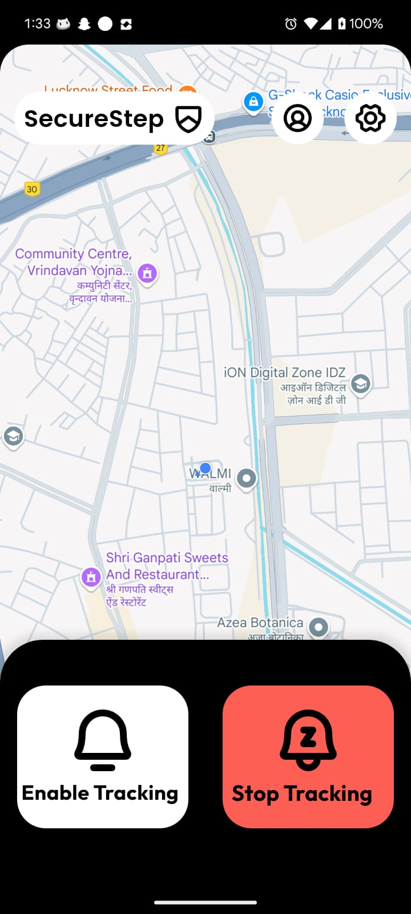
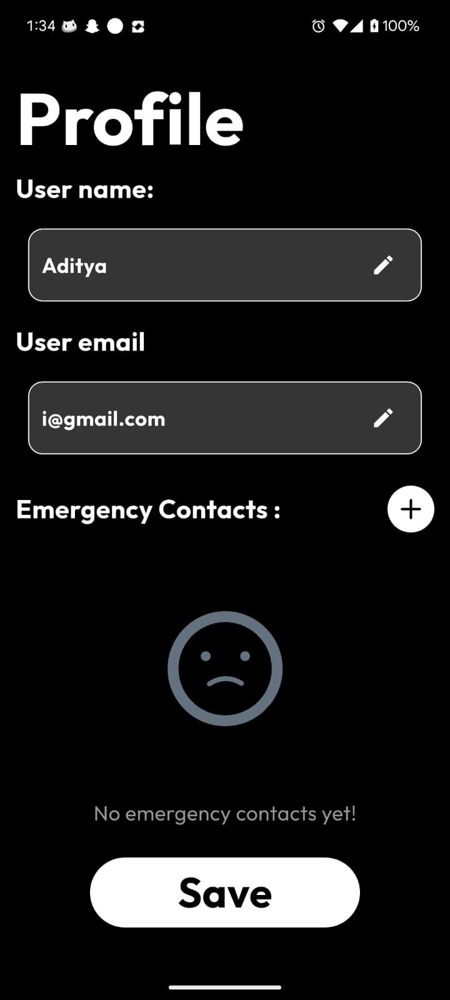
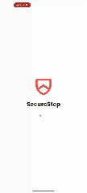

# SecureSteps

SecureSteps is a Flutter-based women’s safety application that runs **24/7 in the background** and allows users to send **live location alerts to guardians in just 1–2 seconds in emergency**.

## 🚀 Features
- **Vibrate to Alert** – Simply shake or perform the configured motion to trigger an emergency alert.  
- **24/7 Background Service** – Works continuously in the background for maximum safety.  
- **Live Location Sharing** – Sends real-time GPS location updates instantly to selected guardians.  

## 🛠 Tech Stack
- **Flutter** (UI Framework)  
- **Dart** (Programming Language)  

## Screenshots

  
  
<!--    -->

